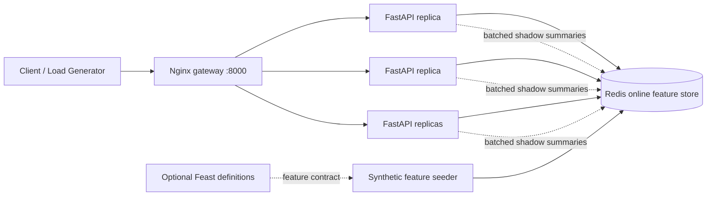
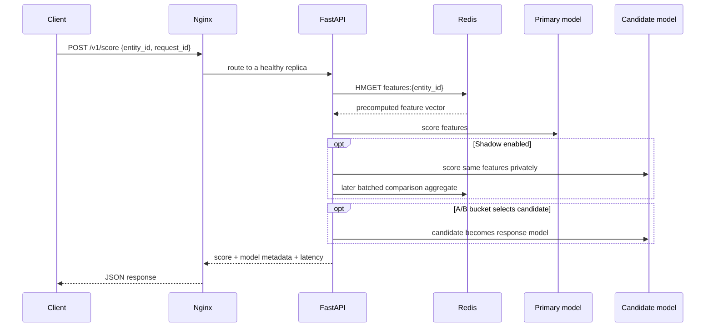

# Real-Time Feature Store + Model-Serving System

A Dockerized reference system for serving low-latency, synthetic fraud-risk scores from precomputed online features. It demonstrates the core parts of production ML infrastructure: an online feature store, deterministic model routing, A/B experiments, shadow scoring, observability, and reproducible load testing.

> **Important:** This is a learning and portfolio project using entirely synthetic data. It is not a real financial-decisioning system and must not be used to approve, deny, or price real transactions.

## In simple English

Imagine an online shop or bank needs a quick answer to: “Does this event look risky?”

Rather than calculating everything from scratch, the system prepares a small **feature card** for every entity in advance: recent activity, amount trends, account age, and similar signals. Those cards live in Redis, an extremely fast in-memory database. When a request arrives, the API reads that card, runs a small scoring model, and returns a score in milliseconds.

The system can also try a new model safely:

- **A/B mode:** a deterministic percentage of requests receives the candidate model’s result.
- **Shadow mode:** the current production model answers the request, while the candidate model scores the same request privately. The difference is aggregated for later review; the user-facing response is unchanged.

## What problem it solves

Many ML demos focus only on training a model. Production services also need to retrieve the same features at request time, manage model rollouts, observe latency, and prove a candidate is safe before promotion.

This project provides a compact implementation of that serving path:

1. Synthetic data is generated and written to Redis ahead of time.
2. A request asks for a score by `entity_id`.
3. The serving API fetches the feature vector with one Redis hash read.
4. The primary model scores it and responds.
5. A candidate model is selected deterministically for A/B traffic and/or evaluated in shadow mode.
6. Shadow comparison totals are buffered and batched to Redis rather than adding a Redis write to every request.

## Architecture



The Docker Compose topology is:

| Component | Purpose |
| --- | --- |
| Nginx | Public entry point, upstream keep-alive, least-connections routing, and retries across API replicas. |
| FastAPI + Uvicorn | Stateless scoring service. Compose starts four replicas, each with two Uvicorn workers. |
| Redis | Online feature store and durable aggregate for shadow-comparison summaries. |
| Optional Feast definitions | Shows how the same feature schema maps to a Feast-style feature repository; Redis remains the online store in this runnable demo. |
| Locust | Reproducible HTTP load generator. |

### Request flow



## Technology stack

| Area | Technology |
| --- | --- |
| API | Python 3.12, FastAPI, Uvicorn |
| Online feature store | Redis 7 hashes, async `redis-py` client |
| Model serving | Lightweight deterministic Python risk models |
| Rollouts | Stable SHA-256 request bucketing, A/B assignment, shadow comparison |
| Gateway | Nginx |
| Containers | Docker and Docker Compose |
| Testing | Pytest, Ruff |
| Load testing | Locust |
| Feature definitions | Feast-compatible Python definitions (optional) |

## Repository layout

```text
app/                 FastAPI app, feature-store client, models, shadow recorder
feature_repo/        Optional Feast-compatible feature definitions
infra/               Nginx configuration
loadtest/            Locust workload
scripts/             Seeder, benchmark verifier, PowerShell benchmark runner
tests/               Unit and service behavior tests
Dockerfile           API image
docker-compose.yml   Redis + four API replicas + Nginx topology
```

## Prerequisites

- Docker Desktop with Linux containers running
- Docker Compose v2
- Python 3.12+ only if running tests outside Docker

Port `8000` is used by the gateway. Port `6379` is published by Redis for local inspection; remove that mapping from `docker-compose.yml` if it conflicts with another local Redis instance.

## Run locally

From the repository root:

```powershell
docker compose up --build -d
docker compose exec -T api python scripts/seed_synthetic_features.py
```

Open the interactive API documentation at [http://localhost:8000/docs](http://localhost:8000/docs).

Score a seeded synthetic entity:

```powershell
Invoke-RestMethod `
  -Method POST `
  -Uri http://localhost:8000/v1/score `
  -ContentType 'application/json' `
  -Body '{"entity_id":"user-000001","request_id":"demo-001"}'
```

Example response:

```json
{
  "entity_id": "user-000001",
  "score": 0.3127,
  "risk_band": "low",
  "model_version": "primary-v1",
  "served_by": "primary",
  "ab_bucket": 83,
  "shadow_compared": true,
  "inference_latency_ms": 0.42
}
```

`inference_latency_ms` measures the application’s scoring-path latency. For end-to-end client latency, use the `Server-Timing` response header or the Locust benchmark output.

Useful operations:

```powershell
docker compose ps
docker compose logs -f gateway
docker compose stop
docker compose down
```

`docker compose stop` preserves the containers and Redis volume. `docker compose down` removes containers but preserves the named Redis volume unless `-v` is added.

## API

| Method | Route | Description |
| --- | --- | --- |
| `GET` | `/health` | Liveness/readiness check, including Redis connectivity. |
| `POST` | `/v1/score` | Scores one synthetic entity. |
| `GET` | `/v1/shadow/summary` | Returns accumulated primary-vs-candidate comparison statistics. |
| `GET` | `/metrics` | Prometheus-style request and latency metrics. |
| `GET` | `/docs` | Swagger UI. |

### Request contract

```json
{
  "entity_id": "user-000001",
  "request_id": "a-stable-client-request-id"
}
```

`request_id` is important for stable experiment assignment. The API hashes it with SHA-256 to choose a bucket, so retries with the same ID keep the same model assignment.

## Feature contract

Redis stores one hash per entity under `features:{entity_id}`. The current synthetic schema contains:

| Field | Meaning |
| --- | --- |
| `avg_transaction_amount_7d` | Seven-day average transaction amount. |
| `transaction_count_1h` | Transaction count in the previous hour. |
| `account_age_days` | Synthetic account age. |
| `device_trust_score` | Synthetic device trust signal between zero and one. |
| `chargeback_rate_30d` | Synthetic 30-day chargeback rate. |
| `updated_at_ms` | Epoch-millisecond freshness timestamp. |

The seeder creates deterministic synthetic entities, so a fresh clone produces valid, repeatable example data without credentials or real customer records.

## Model rollout behavior

Configuration is provided by environment variables in `docker-compose.yml`:

| Variable | Default | Effect |
| --- | --- | --- |
| `CANDIDATE_TRAFFIC_PERCENT` | `10` | Percentage of stable A/B buckets served by the candidate model. |
| `SHADOW_ENABLED` | `true` | Scores the candidate alongside the response model. |
| `SHADOW_FLUSH_INTERVAL_MS` | `1000` | Maximum interval before buffered shadow totals flush to Redis. |
| `SHADOW_FLUSH_BATCH_SIZE` | `250` | Flush when this many comparison records have accumulated. |
| `FEATURE_TTL_SECONDS` | `900` | Rejects stale feature cards. |

To review candidate behavior:

```powershell
Invoke-RestMethod http://localhost:8000/v1/shadow/summary
```

Promotion should be an operational decision based on comparison metrics, labelled outcomes, bias/fairness review where applicable, rollback readiness, and an independently verified performance run. The demo intentionally does not auto-promote a model.

## Tests and code quality

Create a virtual environment and install development dependencies:

```powershell
python -m venv .venv
.\.venv\Scripts\Activate.ps1
pip install -e ".[dev]"
```

Run the checks:

```powershell
python -m pytest -q
ruff check .
```

The test suite covers:

- primary and candidate model selection;
- deterministic A/B bucket assignment;
- shadow scoring without changing the returned response;
- stale/missing feature behavior;
- benchmark pass/fail evaluation rules.

## Project benchmarks

### Acceptance criteria

The project benchmark is a sustained **1,000 requests/second**, **zero request failures**, and **end-to-end p99 latency at or below 50 ms** over a 60-second measured interval. The verifier rejects a run that misses request volume, has failures, or exceeds the p99 budget.

Run the local benchmark after starting the stack and seeding features:

```powershell
.\scripts\run_benchmark.ps1
```

Artifacts are written beneath `loadtest/results_*` and are intentionally git-ignored. The script uses a 10-second warm-up, resets Locust statistics, runs the measured interval, then feeds the CSV output to `scripts/verify_benchmark.py`.

### Benchmark execution

The benchmark verifier enforces these thresholds.

The Compose architecture is designed for that objective: Nginx distributes traffic across four stateless API replicas, each with two Uvicorn workers; the API uses a single Redis `HMGET` per feature lookup; and shadow summaries are buffered and written in batches. A clean, isolated benchmark run is still required before describing these targets as achieved.

Local Docker Desktop measurements are sensitive to host load, CPU limits, Docker networking, anti-virus, and other containers. For a credible production-style validation, run a distributed Locust generator against a dedicated Linux host or Kubernetes environment, record host/container resource utilization, preserve raw outputs, and repeat the test.

## Operational and production notes

- The API is stateless; scale it horizontally behind the gateway.
- Redis is configured with append-only persistence for the demo. A real deployment should use managed Redis or replication/failover, backups, alerts, and an eviction policy that matches the workload.
- Redis access has no authentication in the local Compose file. Use TLS, credentials, private networking, ACLs, and secret management in a real environment.
- Add request authentication, authorization, rate limits, structured logs, tracing, and a metrics scraper before exposing an API publicly.
- The included models are deliberately small deterministic examples, not trained classifiers. Replace them only with a governed model lifecycle, schema validation, monitoring, and a documented rollback path.
- Feast is represented by feature definitions rather than required at runtime to keep the demo self-contained. In a larger deployment, Feast can own offline/online feature registry workflows while Redis remains the online retrieval layer.

## Continuous integration recommendation

Before publishing changes, a GitHub Actions workflow should run:

```text
python -m pytest -q
ruff check .
docker compose config
```

Keep full load tests out of pull-request CI unless the runner is dedicated and results are comparable; use a scheduled or manually triggered performance environment instead.

## Troubleshooting

| Symptom | Likely cause and fix |
| --- | --- |
| `localhost refused to connect` | Start Docker Desktop, then run `docker compose up --build -d`; confirm with `docker compose ps`. |
| `feature not found` | Seed the store with `docker compose exec -T api python scripts/seed_synthetic_features.py`. |
| `feature is stale` | Reseed the synthetic features or raise `FEATURE_TTL_SECONDS` for local experimentation. |
| Port conflict | Stop the conflicting local service or change the published port in `docker-compose.yml`. |
| Benchmark fails | Treat it as a real failed gate, inspect raw CSV/errors and host resource contention, then rerun in an isolated environment. |

## License

No license has been selected yet. Add a license before distributing or accepting external contributions.
